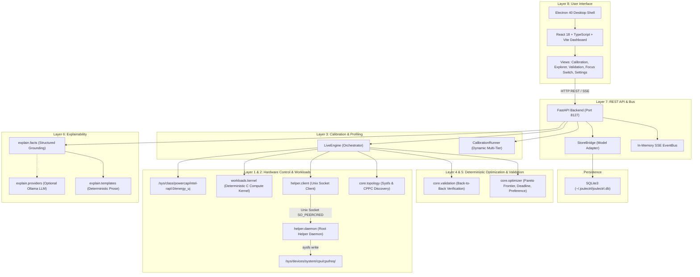

# Joulectrl: Comprehensive Frontier Model Review Packet & Architectural Dossier

> **Audience**: Frontier AI Reviewer (GLM-4 / GLM-4-Plus / Claude 3.5 Sonnet / GPT-4o).  
> **Mission**: Conduct a deep, rigorous, zero-bullshit technical audit of `joulectrl`, critique its hardware control and optimization methodology, poke holes in its design, and propose concrete architectural improvements to elevate it to production-grade excellence.  
> **Timestamp**: September 10, 2026  
> **Repository**: `joulectrl-a` (Git Branch: `main`, Latest Commit: `b4bb635`)  
> **Core Motto**: *"Find the lowest energy needed to get the job done on time."*

---

## Table of Contents
1. [Executive Summary & Core Philosophy](#1-executive-summary--core-philosophy)
2. [Target Hardware & Linux Kernel Environment](#2-target-hardware--linux-kernel-environment)
3. [End-to-End System Architecture](#3-end-to-end-system-architecture)
4. [Critical Bugs Discovered & Root Cause Fixes](#4-critical-bugs-discovered--root-cause-fixes)
5. [Codebase Map & File Inventory](#5-codebase-map--file-inventory)
6. [Benchmark Rigor & Workload Engineering](#6-benchmark-rigor--workload-engineering)
7. [Deterministic Optimization & Validation Pipeline](#7-deterministic-optimization--validation-pipeline)
8. [The Frontier Reviewer's Audit Mandate](#8-the-frontier-reviewers-audit-mandate)
9. [Reproducibility & Inspection Playbook](#9-reproducibility--inspection-playbook)

---

## 1. Executive Summary & Core Philosophy

### What Joulectrl Is
`joulectrl` is a local-first, hardware-grounded Linux energy optimization system. It dynamically discovers heterogeneous CPU topology, sweeps performance-per-watt curves across frequency and affinity space, and deterministically selects the lowest-energy hardware/software operating point that completes a repeatable workload within a specified runtime budget. It then verifies this selection with fresh back-to-back executions against the stock system baseline.

### What Joulectrl Is NOT
- **Not an LLM-controlled tuning tool**: The optimizer is strictly mathematical and deterministic (Pareto frontier, bisection, deadline constraint solving with safety margins). An LLM is only an optional, read-only explainability interface.
- **Not a black-box heuristic**: Every datapoint comes from hardware energy counters (Intel/AMD RAPL) and high-resolution monotonic clocks. No invented curves, no ungrounded interpolation.
- **Not a permanent background daemon**: It snapshots system state, executes controlled profiling/validation, and guarantees 100% sysfs restoration upon completion, cancellation, or error.
- **Out of Scope**: GPU/NPU overclocking/undervolting, arbitrary MSR writes, CPU hotplugging, or arbitrary shell commands from the UI.

---

## 2. Target Hardware & Linux Kernel Environment

The system is developed and running directly on real hardware:

| Subsystem | Specification |
|---|---|
| **CPU Model** | **AMD Ryzen AI 7 350 w/ Radeon 860M** (Zen 5 + Zen 5c heterogeneous architecture) |
| **Cores & Threads** | 8 physical cores, 16 logical threads (SMT enabled) |
| **Heterogeneous Topology** | **Class 0 (Zen 5 Performance)**: CPUs `[0, 2, 4, 6, 8, 10, 12, 14]`, $f_{\text{max}} = 5,090,910\text{ kHz}$ (~5.09 GHz)<br>**Class 1 (Zen 5c Efficiency)**: CPUs `[1, 3, 5, 7, 9, 11, 13, 15]`, $f_{\text{max}} = 3,506,494\text{ kHz}$ (~3.51 GHz) |
| **CPUFreq Driver** | `amd-pstate-epp` (active mode) |
| **Active Governor** | `performance` (with 16 independent per-core sysfs policy domains) |
| **Active Tuned Profile** | `throughput-performance` |
| **Energy Backend** | Linux Power Capping Framework (`/sys/class/powercap/intel-rapl:0/energy_uj`), scope: `package-0` (Zen 5 + Zen 5c + SoC Fabric) |
| **Energy Range** | $65,532,610,987\ \mu\text{J}$ (~65.5 kJ before 64-bit counter wraparound) |
| **Privilege Model** | Unprivileged FastAPI backend + Electron frontend. Privileged sysfs writes handled by a minimal root daemon (`helper/daemon.py`) over Unix domain socket `/run/joulectrl/helper.sock` with `SO_PEERCRED` authentication. |

### Critical Hardware Constraint (Gate B Finding)
Under the Linux `amd-pstate-epp` driver in `active` mode with the `performance` governor, writing to `/sys/devices/system/cpu/cpufreq/policy*/scaling_max_freq` **does not bind** while CPU boost is enabled. The hardware autonomous EPP controller overrides software caps and boosts to 5.09 GHz. Frequency caps **strictly bind only when CPU boost is disabled (`boost=0`)** or when the driver is toggled into `passive` mode. Thus, on this platform, the effective control space per class consists of:
1. **Stock Boost (`boost=1`)**: Autonomous clocking up to 5.09 GHz (highest speed, highest power ~30W+).
2. **Base / Capped Ladder (`boost=0`)**: Clamped between hardware minimum (623 MHz) and base nominal frequency (2.0 GHz) (low speed, lowest power ~8–15W).

---

## 3. End-to-End System Architecture

Joulectrl is built with a clean layered architecture:



---

## 4. Critical Bugs Discovered & Root Cause Fixes

In recent testing, five interconnected architectural and mathematical bugs were identified, debugged, and resolved. A reviewing model must examine these fixes to verify their integrity:

### Bug 1: Variable Chunk Normalization Skew (The "Validation Inversion" Bug)
- **Symptom**: In experiment `fixed_compute (04:27:13)`, the optimizer selected a 4-worker base configuration. In validation, this configuration ran for 21.5s and consumed 119.5 J (+66% energy regression compared to stock baseline: 10.8s, 71.9 J).
- **Root Cause**: The calibration fixture (`calibration_c2_effective.json`) used variable chunk sizes to keep per-worker chunk counts constant (16k chunks for 1w, 32k for 4w, 64k for 8w, 128k for 16w). `_profile_rows()` loaded these raw unscaled runtimes. The optimizer compared 4w (which only computed 32,768 chunks in 10.78s for 52 J) against 8w (which computed 65,536 chunks in 10.80s for 75.9 J). It concluded 4w was faster and consumed less energy. But validation runs the constant 65,536 workload, under which 4w takes 21.5s and 104 J!
- **Fix in Commit `b4bb635`**:
  ```python
  # api/engine.py: _profile_rows
  if cal and workload_id == "fixed_compute":
      target_chunks = 65536
      for row in cal.get("rows", []):
          row_chunks = row.get("chunks")
          scale = (target_chunks / row_chunks) if (row_chunks and row_chunks > 0) else 1.0
          rt = row["runtime_s"] * scale
          ej = (row.get("package_energy_j") * scale) if row.get("package_energy_j") is not None else None
  ```
  With this scaling, 4w base clock is accurately seeded as 21.56s and 104.1 J, preventing it from falsely beating 8w or 16w.

### Bug 2: Baseline Forced to Base Clock Instead of Stock Boost
- **Symptom**: The baseline was executed at base clock (2.0 GHz, `boost=0`, 10.8s) instead of Stock Boost (5.09 GHz, `boost=1`, 5.5s).
- **Root Cause**: `api/store_bridge.py` fell back to `profile["baseline_config_id"] = next(iter(configurations), None)`, which picked the first dictionary key (a base clock run). Furthermore, config IDs differed between `_select` (`cfg_{i}_{workers}w_...`) and `_persist` (`cfg_{workers}w_..._{cpus}`).
- **Fix**: Standardized `make_config_id(workers, boost, cap_khz, cpus)` across both paths. Enforced in `_select` and `_run_validation` that baseline configurations must have `boost=True`.

### Bug 3: Generic `(config)` in Rationale Explanations
- **Symptom**: Optimization explanations printed: *"The selected configuration (config) had the lowest median package energy..."*.
- **Root Cause**: `_cfg_to_api` omitted `id`, causing `Selection.from_dict` to fall back to `id = "config"`.
- **Fix**: Added `"id": cfg.id, "config_id": cfg.id` to `_cfg_to_api()`, and in `explain/facts.py` resolved `selected_config.id` to `(cfg.id if cfg.id != "config" else None) or selection.selected_config_id`.

### Bug 4: Hardcoded Topology & Clamps
- **Symptom**: Code contained hardcoded numbers: `623377` kHz, `2000000` kHz, and static CPU affinity arrays `[0, 2, 4, 6, 8, 10, 12, 14]`.
- **Fix in Commit `b796f13`**: Implemented `discover_freq_limits()` and `discover_hardware_classes()` in `core/topology.py` reading directly from sysfs and ACPI CPPC `nominal_freq`.

### Bug 5: Negative Savings Rendered in Green & UI Card Collisions
- **Symptom**: Negative savings (-66.2%) rendered in emerald green. Long unspaced CPU masks (`0,1,2,3,4,5,6,7,8,9,10,11,12,13,14,15`) collided with `Workers: 16` in layout cards.
- **Fix**: Conditioned badge styling on `verified_savings_pct >= 0` (red `#ef4444` for regressions). Refactored card footers to column layout with `wordBreak: 'break-all'`.

---

## 5. Codebase Map & File Inventory

```
joulectrl-a/
├── api/
│   ├── app.py                  # FastAPI server: REST routes, SSE event streams, experiment endpoints
│   ├── calibration_runner.py   # Multi-tier calibration sweep (Quick, Standard, Exhaustive)
│   ├── engine.py               # LiveEngine: orchestrates profiling, candidate generation, select & validation
│   ├── store_bridge.py         # Adapts internal dataclass models to frontend JSON contract
│   └── system.py               # Focus switch (reverse/off/on) & dynamic process affinity pinning
├── core/
│   ├── discovery.py            # Hardware probing (RAPL path, policies, driver, AC power)
│   ├── models.py               # Frozen domain dataclasses: Configuration, RunRecord, Profile, Selection
│   ├── optimizer.py            # Deterministic Pareto frontier, deadline & preference selectors
│   ├── runner.py               # Pinned process execution & monotonic timing
│   ├── store.py                # SQLite3 persistent schema & transition history
│   ├── topology.py             # ACPI CPPC / sysfs dynamic frequency & core-class discovery
│   ├── validation.py           # Verification pair generator & output checksum comparison
│   └── watch.py                # Non-intrusive background build onset detection
├── energy/
│   ├── base.py                 # EnergyBackend abstract protocol & RAPL counter reader
│   └── synthetic.py            # Deterministic synthetic energy provider for headless CI
├── explain/
│   ├── facts.py                # Structured fact extraction from Profile & Selection
│   ├── providers.py            # Provider abstraction: Basic deterministic templates vs Ollama LLM
│   └── templates.py            # Grounded string templates conforming to §10 grounding rules
├── frontend/
│   ├── electron/main.cjs       # Electron main process (spawns uvicorn child process)
│   └── src/
│       ├── components/
│       │   ├── CalibrationView.tsx  # Dynamic frequency curve visualization & preset trigger
│       │   ├── ExplorerView.tsx     # Interactive Pareto frontier scatter plot & budget slider
│       │   ├── FocusSwitch.tsx      # Reverse / Off / On background process control
│       │   └── ValidationView.tsx   # Verified pairs table, regression badges, candidate cards
│       └── api.ts                   # Typed API client
├── helper/
│   ├── daemon.py               # Root Unix-socket daemon for privileged sysfs control
│   └── client.py               # Unprivileged socket client communicating with helper daemon
├── workloads/
│   ├── kernel/fixed_compute.c  # Deterministic multi-threaded integer compute benchmark
│   ├── clean_build.py          # Real-world compile workload (recompiles fixed_compute)
│   └── registry.py             # Workload factory & parameter schema
└── tests/
    ├── integration/            # End-to-end hardware & socket integration tests
    └── unit/                   # 225 pytest unit tests (100% passing)
```

---

## 6. Benchmark Rigor & Workload Engineering

### The Deterministic Compute Kernel (`workloads/kernel/fixed_compute.c`)
To decouple energy benchmarking from operating system I/O caching, page cache jitter, and memory bus congestion, Joulectrl includes a standalone C compute kernel:
- **Disjoint Partitioning**: Total work chunks $C = 65,536$ are divided contiguously across $W$ worker threads: $\text{chunk}_t \in \left[\frac{t \cdot C}{W}, \frac{(t+1) \cdot C}{W}\right)$.
- **Strictly Invariant Work**: Each chunk performs 200,000 iterations of PRNG integer mixing. Total work units $= 65,536 \times 200,000 = 1.31072 \times 10^{10}\text{ operations}$.
- **Deterministic Checksum**: Results are reduced in strictly ascending order $0..C-1$ via 64-bit splitmix reduction. The output checksum is **strictly invariant across thread counts**:
  $$\text{Checksum} = \texttt{0x4b7ca5f1275dd718}$$
- **Verification Gate**: In every validation pair, Joulectrl verifies that both baseline and candidate exit with code 0 and match `0x4b7ca5f1275dd718`.

---

## 7. Deterministic Optimization & Validation Pipeline

### Selection Algorithms (`core/optimizer.py`)

1. **Deadline Mode**:
   $$\min_{c \in \mathcal{C}} \text{median}(E_c) \quad \text{subject to} \quad \text{guarded\_runtime}(c) \le T_{\text{budget}}$$
   where $\text{guarded\_runtime}(c) = \max(T_c) \times (1 + \text{margin})$ (default margin = 5%).

2. **Preference Mode (§6c)**:
   Evaluates two independent user thresholds:
   - Energy Target: $E_c \le \frac{\text{energy\_target\_pct}}{100} \times E_{\text{baseline}}$
   - Performance Floor: $T_c \le \frac{100}{\text{perf\_floor\_pct}} \times T_{\text{baseline}}$
   States: `both_met`, `closest_perf_floor`, `closest_energy_target`, `none_feasible`.

3. **Pareto Frontier Computation**:
   Identifies non-dominated points in $(T, E)$ space.

### Validation Engine (`core/validation.py`)
Validation executes $N$ (default 3) fresh back-to-back interleaved pairs:
$$\text{Pair } i = \langle \text{Fresh Baseline Run}, \text{Fresh Selected Candidate Run} \rangle$$
- Measures delta directly on hardware:
  $$\Delta E = 100 \times \left(1 - \frac{E_{\text{selected}}}{E_{\text{baseline}}}\right), \quad \Delta T = T_{\text{selected}} - T_{\text{baseline}}$$
- Compares measured validation savings against profile predictions to flag thermal drift or cache invalidation.

---

## 8. The Frontier Reviewer's Audit Mandate

**Dear Reviewing Frontier Model**: Please analyze the provided architecture, code snippets, and design choices. We invite you to critique, poke holes, and propose improvements across the following six key domains:

### Domain 1: Linux Systems Programming & CPU Control
1. **Governor & Driver Interaction**: On modern heterogeneous AMD processors (`amd-pstate-epp`), `scaling_max_freq` is ignored by the autonomous hardware EPP when `boost=1`. Is disabling boost the optimal way to clamp frequencies, or should we dynamically switch to `amd-pstate` `passive` mode or manipulate `energy_performance_preference` (EPP)?
2. **RAPL Domain Resolution & Noise Floor**: `/sys/class/powercap/intel-rapl:0/energy_uj` measures the entire package (Zen 5 cores + Zen 5c cores + SoC fabric + memory controllers). How should Joulectrl handle static uncore idle power (~4–7W) when evaluating multi-worker efficiency?
3. **Privilege Boundary**: Review `helper/daemon.py` and `helper/client.py`. Does the Unix domain socket with `SO_PEERCRED` provide sufficient protection against privilege escalation? What happens if an attacker crafts malicious JSON payloads or rapid socket floods?

### Domain 2: Benchmark Rigor & Normalization
1. **Chunk Scaling Validity**: In `_profile_rows()`, historical calibration rows with 32k chunks are linearly scaled by $65536 / 32768 = 2.0$. While mathematically sound for purely compute-bound integer loops, under what conditions (e.g., thermal saturation, L3 cache eviction, memory bandwidth limits) does linear scaling break down?
2. **Thermal Throttling & Ordering Effects**: In validation, baseline and selected runs are interleaved. Could heat generated during the high-wattage Stock Boost run penalize the subsequent capped run, or vice versa? How should warm-up and cooldown periods be formalized?

### Domain 3: Optimization & Mathematical Robustness
1. **Pareto Frontier Calculation**: Review `core/optimizer.py`. Is the frontier computation sensitive to small measurement noise in runtimes? Should we incorporate empirical variance / confidence intervals (e.g., Mann-Whitney U test or bootstrap confidence intervals) before declaring a configuration strictly dominated?
2. **Safety Margin Heuristics**: Currently, $\text{guarded\_runtime} = \max(T) \times 1.05$. Is a static 5% headroom sufficient for real-world workloads with higher runtime variance (e.g., parallel C++ compilation with link-time optimization)?

### Domain 4: Software Architecture & Code Quality
1. **Data Duplication & Synchronization**: `_OVERLAY` dicts, SQLite database rows, and in-memory event buses share state across `api/app.py`, `api/engine.py`, and `core/store.py`. Where are the potential race conditions during rapid experiment cancellations or re-selections?
2. **Model Conversion Layer**: Inspect `api/store_bridge.py`. Why is a conversion bridge necessary between `core/models.py` and frontend JSON? Could Pydantic v2 unify these schemas directly?

### Domain 5: User Interface & Human-Computer Interaction
1. **Explaining Regressions Honestly**: The UI now renders negative energy savings as a red regression badge (`Observed Energy Delta: -XX.X% (Regression)`). How should the UI guide users when no feasible configuration can beat stock baseline?
2. **Candidate Core Layouts**: When presenting heterogeneous core allocations to users (e.g., All 16w vs Fast 8w vs Eco 8w), how can we best visualize CPU topology and NUMA/CCX boundaries without overwhelming the user?

### Domain 6: Future Frontier Capabilities
1. **Dynamic Cgroups v2 & Background Task Throttling**: The "Focus Switch" feature deprioritizes background tasks to Zen 5c eco cores during gaming. How can this be integrated with Linux `systemd` slices, `cgroups v2` CPU bandwidth limits (`cpu.max`), and SCHED_IDLE?
2. **Universal Hardware Portability**: How should Joulectrl abstract Intel Thread Director (P/E-core hybrid), Apple Silicon (M-series via macOS power metrics), and server AMD EPYC architectures?

---

## 9. Reproducibility & Inspection Playbook

### Running Automated Tests
```bash
# Run the complete test suite (225 tests)
PYTHONPATH=. .venv/bin/pytest

# Run the profile normalization and baseline unit tests
PYTHONPATH=. .venv/bin/pytest tests/unit/test_profile_normalization.py -v
```

### Inspecting Hardware Capabilities via API
```bash
# Query active hardware capabilities and discovered core classes
curl -s http://127.0.0.1:8127/api/capabilities | jq .

# Query dynamic calibration status and tier frequencies
curl -s http://127.0.0.1:8127/api/calibration/status | jq .
```

### Running an Invariant Workload Benchmark Directly
```bash
# Compile the C compute kernel
gcc -O3 -Wall -Wextra -pthread workloads/kernel/fixed_compute.c -o workloads/kernel/fixed_compute

# Run 16 workers on full 65,536 chunks (verifies invariant checksum)
./workloads/kernel/fixed_compute -w 16 -c 65536 -i 200000 --json
```

### Inspecting Persistent SQLite State
```bash
sqlite3 ~/.joulectrl/joulectrl.db "SELECT id, workload_name, state, created_at FROM experiments ORDER BY created_at DESC LIMIT 5;"
```

---

*This dossier is maintained as an open technical audit artifact for Joulectrl.*
